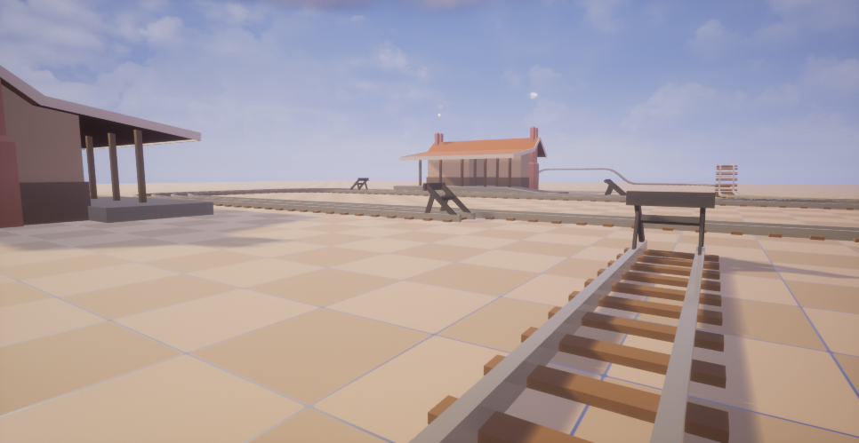

# 🚂TrainGame

🚅 A game about trains, train tracks, train management, train history, train appreciation, train musings and all-round general train paraphernalia.

> Steam trains produce steam, electric trains do not\
What's that? Oh yeah, trains can go up hills too

 

> There are also *long* trains and stations with names

